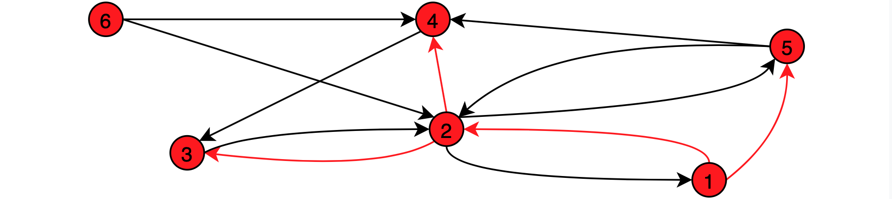

# python-graph

## Overview

The goal of this project was to implement various graph algorithms in Python and to provide a way to visualize graphs. The supported graph types include:
- Directed Graphs
- Undirected Graphs
- Weighted Graphs
- Unweighted Graphs

The implemented algorithms include:
- DFS
- BFS
- Dijkstra's Algorithm
- Detection and extraction of circles

For a first overview of the usage and implemented functionalities have a look at [`demo.py`](demo.py).

## Algorithms

The algorithms are implemented in corresponding classes and operate on an instance of the [`Graph`](graph.py) class. The [`Graph`](graph.py) class itself already offers simple methods to examine graphs, e.g. to check if the graph is a subgraph of another one. For all implemented algorithms the following applies:
- They are bound to the passed graph object from the initialization on
- All algorithms are executed only once on the passed graph object
- Computed results are stored and reused if they are required

## Visulization

The visualization of the graphs is provided by the [`Visu`](visu.py) class. Like all others, this class operates on a given graph object. [`Visu`](visu.py) allows to visualize graphs, to mark subgraphs in the passed graph (e.g. BFS Spanning Tree) and to remove existing markings.

## Verification

For all classes and methods (except [`Visu`](visu.py)) unit tests were written using the standard library [`unittest`](https://docs.python.org/3/library/unittest.html) module. By running [`tests.py`](tests.py) all test cases are checked to verify the correct functionality of the implemented algorithms.

## Requirements

In order to use the [`Graph`](graph.py) class and run the graph algorithms, besides pure Python only the [`numpy`](https://numpy.org) module is required.

For the visualization of graphs using the [`Visu`](visu.py) class, [`iGraph`](https://igraph.org/python) is additionally needed.
